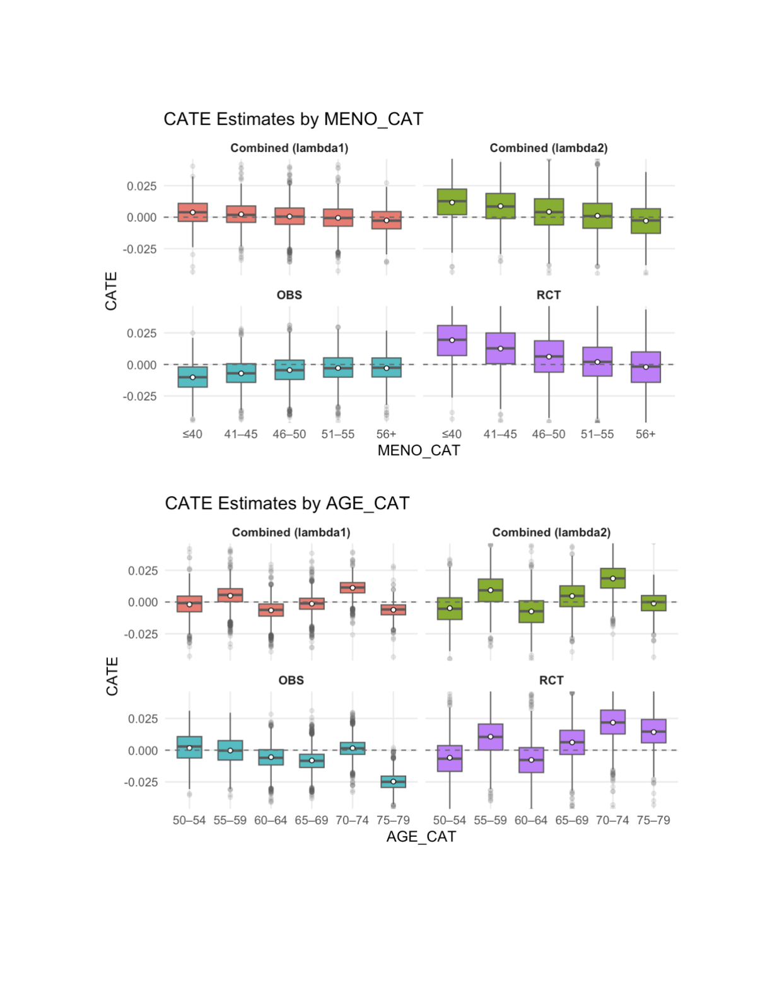
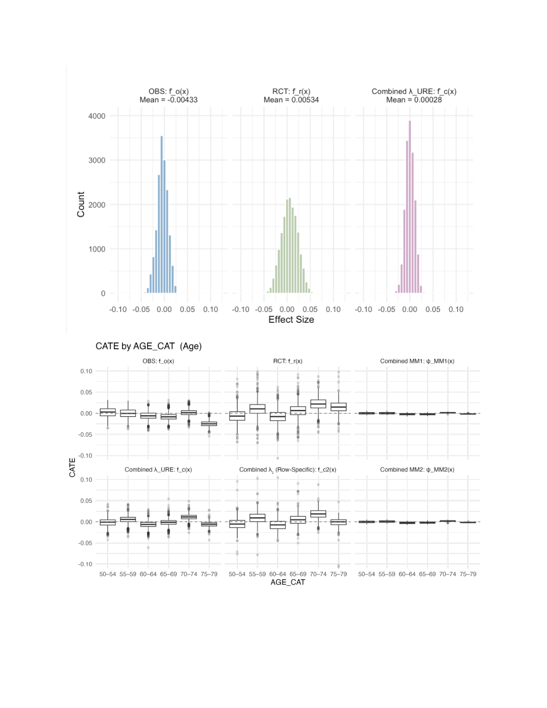

# WHI CATE Combined Estimators (RCT + Observational)

R and Quarto pipelines from my 2025 summer research with Prof. Evan Rosenman.  
Goal: estimate subgroup treatment effects (CATEs) from WHI randomized and observational cohorts, then combine them with empirical Bayes shrinkage to improve stability.

## What this shows a recruiter

- A full causal pipeline: cohort harmonization, propensity score diagnostics, CATE estimation, uncertainty estimation, and combination rules
- Reproducible reporting: Quarto reports that generate plots and aggregate evaluation tables
- Practical validation: balance checks, calibration, and out of sample evaluation

## Key results and diagnostics

- Observational propensity score diagnostics: **AUC = 0.717** and **max weighted SMD = 0.027**  
- RCT uncertainty: **100 bootstrap draws**, refit learner each draw, use subgroup variance in shrinkage weighting
- Combined estimators: global **λURE** and row specific **λ2(x)** shrinkage weights, plus moment matching baselines

## Figures

### Combined vs OBS vs RCT subgroup CATE summaries (AGE and MENO)


### Distribution view and AGE subgroup comparisons


## Method sketch

1. Fit a propensity score model on the observational cohort, then verify balance after weighting.
2. Estimate CATEs using an X learner on both data sources.
3. Bootstrap the RCT to estimate subgroup level uncertainty.
4. Combine observational and RCT CATEs using empirical Bayes shrinkage (λURE and λ2), and compare against baselines.
5. Evaluate calibration and out of sample behavior using aggregate diagnostics.

## Repo structure

`code/0924/`
- `0718combined_estimator.qmd`  
  Combined estimators (λURE, λ2, moment matching), calibration, and out of sample evaluation
- `0718 Obs CATE.qmd`  
  Observational CATE pipeline, including propensity score modeling and diagnostics
- `0718 RCT Bootstrap.qmd`  
  RCT bootstrap pipeline for subgroup uncertainty estimation

`outputs/0924/`
- Aggregate only plots and summary tables used for evaluation and writeups

## Run (requires approved local WHI access)

This repo does not include WHI participant level data. To reproduce results, set your local data paths near the top of each Quarto file.

```bash
quarto render "code/0924/0718combined_estimator.qmd"
quarto render "code/0924/0718 Obs CATE.qmd"
quarto render "code/0924/0718 RCT Bootstrap.qmd"
```

## Research poster

- `assets/research_poster.pdf` (redacted)

## Data and privacy

- This public repo contains code and aggregate outputs only, no participant level WHI records or identifiers.
- Keep any local WHI data outside the repo. `.gitignore` is intended to prevent common local data artifacts from being committed.
- If you are uncertain whether derived outputs are allowed to be public under your WHI agreement, remove `outputs/` from the public repo.
